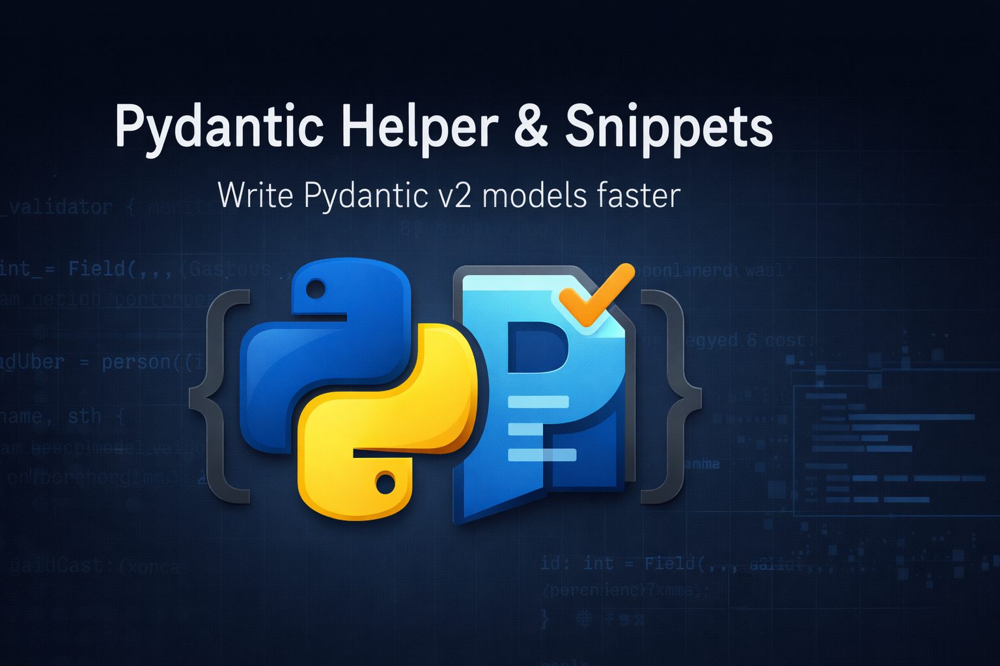

# Pydantic Helper & Snippets 🚀

### Modern **Pydantic v2** snippets and helpers for Python developers.

☕ **Support the project:**  

Write clean, correct, and production-ready Pydantic models faster — without memorizing syntax.

---

## ✨ Features

✔ Pydantic v2 BaseModel snippets  
✔ Field and model validators (v2 syntax)  
✔ ConfigDict helpers (v2 compliant)  
✔ Nested model templates  
✔ Zero runtime dependencies  
✔ Works offline  
✔ No deprecated APIs  

---

## ⚡ Quick Usage

Open a Python file and type:

- `pydantic-model` → Create a BaseModel
- `pydantic-validator` → Field validator
- `pydantic-model-validator` → Model validator
- `pydantic-config` → ConfigDict

Or open Command Palette:

## 🧠 Why This Extension?

- Built **strictly for Pydantic v2**
- Avoids common migration mistakes from v1
- Lightweight and fast
- No telemetry, no tracking

---

## 🧩 Perfect For

- FastAPI developers
- Backend engineers
- Data validation workflows
- Python API development

---

## 📦 Requirements

- Python 3.8+
- Pydantic v2+

---
🌐 **Website:** https://darsh.fun

## 🛠 License
MIT

